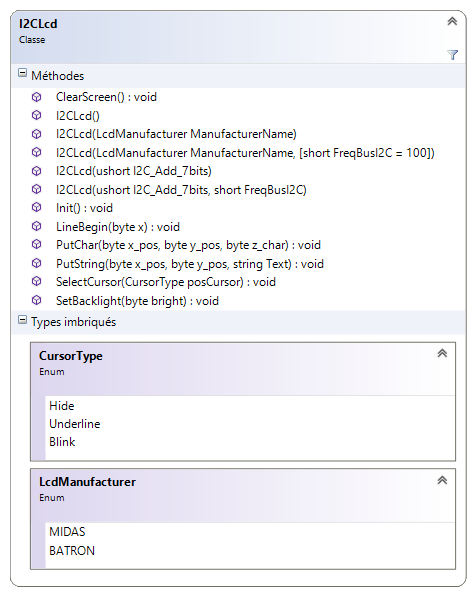

# I2CLCD .NetMF Class

<strong>Description</strong>
-------------------------------------
Source code.

A <strong>.NETMF 4.3 class</strong> write for a PCF2179 circuit : <strong>LCD controllers/drivers</strong>. 

This class is also in the <a href="https://www.nuget.org/packages/WEBGE.Microtoolskit/" target="_blank">MicroToolsKit</a> <strong>library</strong>. Download at <a href="https://www.nuget.org" target="_blank">nuget.com</a>

 

<strong>Hardware</strong>
---------------------
<strong> Targets </strong>: Netduino, Netduino plus 2, Netduino 3, FEZ PANDA 3 et COBRA 3.

<strong>Software</strong>
---------------------
<ul>
<li><strong>Language</strong> : C#</li>
<li><strong>Framework used</strong> : .NETMF 4.3</li>
<li><strong>IDE</strong> : Visual Studio Community 2015</li>
<li><strong>xml</strong> : documentation inside class </li> 
</ul>

<strong> Visual Studio solution</strong>
-------------------------------------
<ul>
<li><strong>I2CLCD</strong>
<ul>
<li><strong>I2CLCD</strong> : .NetMF class</li>

<li><strong>Netduino</strong> : class test program for Netduino board</li>
<li><strong>FezPanda</strong> : class test program for Fez Panda board</li>
</ul>
</li>
</ul>

<strong>Keywords</strong>
----------------------------
I²C Bus, Netduino, FEZ, PANDA, COBRA, C#, NETMF, Visual Studio.

<strong>To get started</strong>
--------------------
See <a href="http://webge.github.io/I2CLCD/" target="_blank">I2CLcd GitHub Pages</a> too get started.

Maintened by <a href="mailto:philippemariano@gmail.com">WebGE</a>

