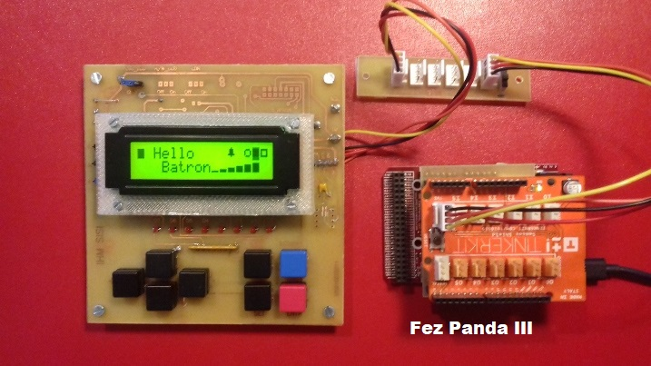

# I2CLCD

## Description

Source code.

A **.NETMF 4.3** class write for a PCF2119 circuit : LCD controllers/drivers.

This class is also in the [MicroToolsKit](https://www.nuget.org/packages/WEBGE.Microtoolskit/) **library**. Download at [nuget.org](https://www.nuget.org).

## Hardware

**Targets**: Netduino, Netduino2 plus, Netduino 3, FEZ PANDA 3 et COBRA 3.

## Software

* **Language** : C#
* **Framework used** : .NETMF 4.3
* **IDE** : Visual Studio Community 2015
* **xml** : documentation inside class  

## Visual Studio solution

* **I2CLCD**

  * **I2CLCD** : .NetMF class

* **Netduino** : class test program for Netduino board
* **FezPanda** : class test program for Fez Panda board

## Assembly

## Video to see on youtube

To come up

## Keywords

I²C Bus, Netduino, FEZ, PANDA, COBRA, C#, NETMF, Visual Studio.

## Tested on

Fez Panda III, Netduino plus 2

## Todo list

any

## To get started

* See [I2CLcd GitHub Pages](http://webge.github.io/I2CLCD) (French).

## Feed on Google+

* [C# embarqué et .NetMF v4.3 : Netduino et GHI FEZ](https://plus.google.com/collection/oaaJX) (French).

## Wiki

* [C# embarqué et .NetMF v4.3 pour les cartes Netduino et GHI FEZ](http://webge.dyndns-server.com/dokuwiki/doku.php?id=netmf43:accueilnetmf)(French).

## Project site

* [MicroToolsKit library](http://webge.dyndns-server.com/dokuwiki/doku.php?id=netmf43:6_microtoolskit) (English)

**Maintened by** [WebGe](mailto:philippemariano@gmail.com)